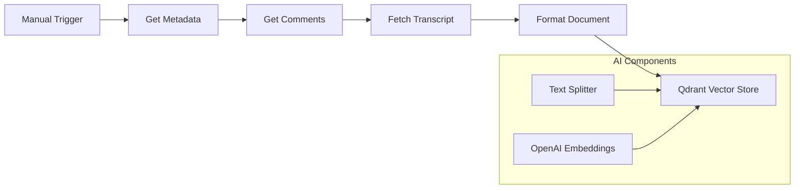

# YouTube RAG Pipeline

This workflow implements a complete "Ingestion & Vectorization" pipeline for YouTube content, fulfilling the requirement for parsed and vectorized video data (metadata, transcripts, comments).

## Architecture



## Features

1.  **Metadata Fetching**: Uses official YouTube API to get title, description, channel, and tags.
2.  **Comment Scraping**: Fetches top comments for community context.
3.  **Transcript Extraction**: Uses a specialized Code Node to extract transcripts *without* requiring complex external APIs (scrapes the hidden player response).
4.  **Vectorization**:
    *   **Splitter**: Recursive Character Text Splitter (1000/200 overlap).
    *   **Embeddings**: OpenAI `text-embedding-3-small`.
    *   **Store**: Qdrant collection `youtube_knowledge_base`.

## Requirements

1.  **Credentials**:
    *   `YouTube OAuth2 API`
    *   `OpenAI API`
    *   `Qdrant API`
2.  **Qdrant Collection**: Ensure a collection named `youtube_knowledge_base` exists (dimension 1536 for OpenAI small).

## Usage

1.  Open the workflow in n8n.
2.  Click "Execute Workflow".
3.  Provide a `videoId` in the input JSON:
    ```json
    {
      "videoId": "y5D2Y_8HcQY"
    }
    ```
4.  The workflow will process the video and upsert vectors to Qdrant.

## Integration with AI Agents

Once the data is in Qdrant, you can connect any **AI Agent** to the `Qdrant Vector Store` node (in "Retriever" mode) to give it access to this knowledge base.
